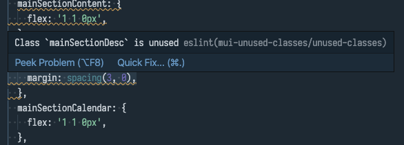

# Detect unused Material-UI classes

This eslint plugin lets you detect unused Material UI classes:



# Usage

1. Add the dependency:
```sh
npm i --save-dev eslint-plugin-mui-unused-classes
```

2. Add it at the end of your plugin list in your `.eslintrc.js`:
```js
module.exports = {
  // ...
  plugins: [
    // ...
    'mui-unused-classes/recommended'
  ]
}
```

That's it! You should now get a warning if you have unused classes. One could also make it an error by adding the actual rule to the `rule` entry in `.eslintrc.js`:

```js
module.exports = {
  // ...
  plugins: [
    // ...
    'mui-unused-classes/recommended'
  ],
  rules: {
    'mui-unused-classes/warn-unused-classes': 2
  }
}
```